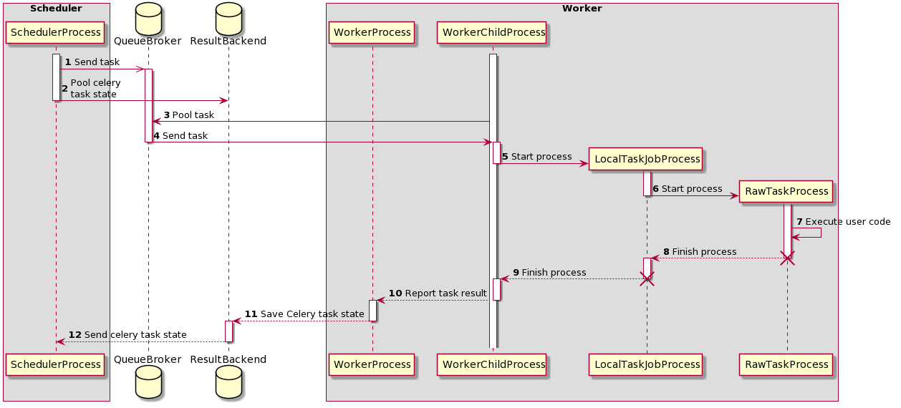

# Airflow

[Airflow](https://airflow.apache.org/docs/apache-airflow/stable/index.html) is used for scheduling and monitoring the data pipeline. It consists of the following components:

- **Scheduler**: The scheduler is responsible for scheduling the tasks and monitoring them. It is also responsible for triggering the tasks.
- **Webserver**: The webserver is responsible for providing the UI for monitoring the tasks.
- **Worker**: The worker is responsible for executing the tasks.

## Prerequisites

- **Python 3.6+**
- **PostgreSQL 9.6+**
- **Redis 3.2+**
- **Oxen 0.7.11+**
- **Minio 2021.6.17+**
- **Ubuntu 22.04+**
- **Docker 20.10+**
